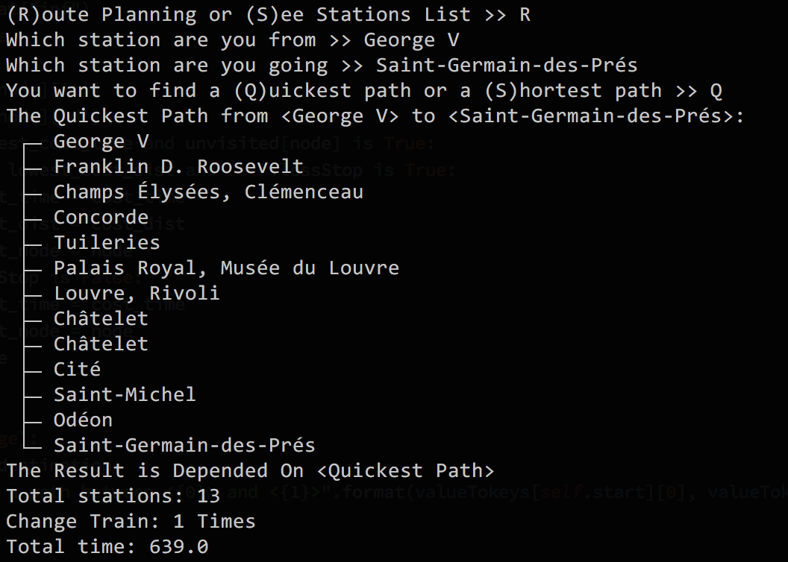

### Route Planner of Métro Paris

It's a exercise about Graph theory. In this project, I implemented a route planner for métro Paris from **station x** to **station y** by **shortest way** or **quickest way**. Instead of using **A\***, I first implemented it in **Dijkstra's algorithms** for finding the "shortest" paths between nodes in this graph. 

<u>For the quickest way</u>, it is trivial that we only need to have the time costs table between each stations. Noticed that for changing another line in same station, we simply assume that it will take 2 mins. Compared to Google map, the time consumption by using Dijkstra are not far from which is estimated by Google map. The main difference comes from the time of changing line might take.

<u>For the shortest way</u>, due to I cannot find a coordinate or distance data for measuring this part (and that's why I didn't implement in A\* because lacking of a good heuristic function), I used the total numbers in a travel as the cost of it, which means **+1** for passing one station.

The console will show like the following image:

